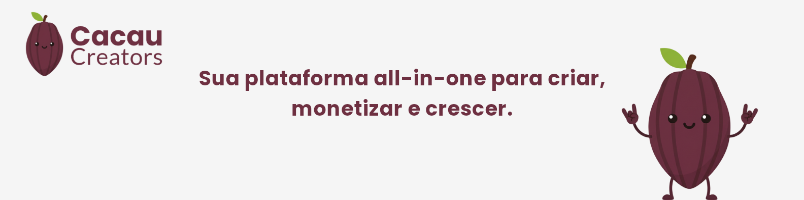
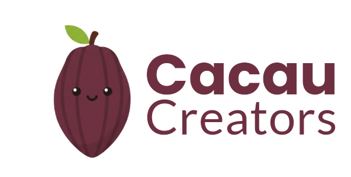
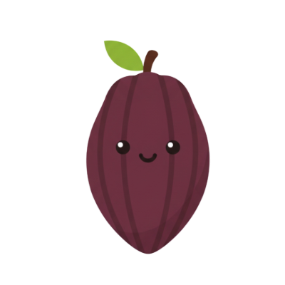

  

  

  Sua plataforma all‑in‑one para criar, monetizar e crescer.

  
  
  
  
  
  
  
  
  
  
  
  
  
  

---

## Visão

O Cacau Creators é uma plataforma tudo‑em‑um que centraliza três pilares do negócio de conteúdo:
- Cacau Links: link‑in‑bio inteligente com personalização e analytics.
- Comunidade e Assinaturas: tiers e conteúdo exclusivo (roadmap).
- Metas de Financiamento: campanhas transparentes com recompensas (roadmap).

Proposta de valor: reduzir a fragmentação de ferramentas, dar insights acionáveis e simplificar a monetização — do primeiro link à operação de uma comunidade completa.

  

---

## Destaques do Produto

- Link‑in‑bio com performance e design premium
  - Organização por drag‑and‑drop, agendamento, expiração e links “espertos”
  - Temas, cores, fontes, logo, backgrounds e modo claro/escuro
  - Páginas públicas rápidas, com foco em SEO e compartilhamento social
- Analytics que importam
  - Views, cliques por link/bloco, CTR e períodos — base para conversões
- Monetização nativa (evoluindo)
  - Doações e produtos simples; base para PIX e repasses a criadores
- Experiência mobile‑first
  - Dashboard do criador e área do assinante pensados para qualquer tela
- Segurança e conformidade
  - Boas práticas de autenticação, proteção de dados e LGPD desde o MVP

---

## Para quem é

- A "Influyoung" (22): quer monetizar o público de TikTok/Instagram com links rastreáveis e produtos simples.
- O "Expert" (35): professor/mentor que precisa de comunidade com assinatura e área de cursos.

---

## Stack e Tecnologias

- Frontend: Next.js (React), TypeScript, Tailwind CSS, shadcn/ui, TanStack Query, Zustand, react‑hook‑form + Zod, dnd‑kit, gráficos (Recharts/Chart.js)
- Backend: Go (HTTP framework, validação, logger estruturado), JWT/OAuth e bcrypt
- Dados/Infra: MongoDB (Atlas/Cosmos API Mongo), Redis (cache/rate‑limit), Azure Service Bus (filas/jobs), Azure Blob Storage (arquivos), Azure Front Door (CDN/WAF)
- Integrações: E‑mail transacional (SendGrid/Resend) e pagamentos (Stripe Connect e/ou Pagar.me, com foco em PIX)
- Qualidade/Observabilidade: linters, testes, monitoramento e métricas gerenciadas

## Arquitetura (alto nível)

Princípios de design
- Desempenho: SSR/ISR para páginas públicas, cache em CDN e RSC para reduzir JS.
- Escalabilidade: serviços stateless, filas duráveis e camadas de cache.
- Segurança: autenticação robusta, idempotência em eventos financeiros e proteção a fraudes.
- DX: monorepo, contratos compartilhados e padrões de código consistentes.

Componentes
- Web pública (páginas de links) e Dashboard do criador
- API de domínio (autenticação, links, monetização e analytics)
- Camadas de dados e eventos (banco, cache, armazenamento, mensageria)

## Roadmap (resumo)

- Fase 1 — MVP: Cacau Links (tema + editor + analytics essenciais) e base de pagamentos
- Fase 2 — Monetização: Assinaturas (tiers), checkout transparente e KYC/repasse
- Fase 3 — Engajamento: Comunidade (feed/comentários) e Metas de financiamento
- Futuro: Loja integrada (digitais/físicos), IA, white‑label e apps mobile nativos

---

## Identidade Visual

Cores de marca
- Primária (Cacau): `#6E3041`
- Secundária (Verde): `#8EB237`
- Background: `#F5F5F5`
- Texto: `#2B1D22`
- Neutro/Borda: `#E6E6E6`

Prévia (badges)

  
  
  
  

---

## Contribuição

- Padrões: Conventional Commits, linters e testes automatizados
- Fluxo: issues, branches por feature e PRs com revisão
- Comunicação: mantenha discussões técnicas nos documentos do repositório

Sugestões são bem‑vindas — criadores e devs crescem melhor juntos.

---

